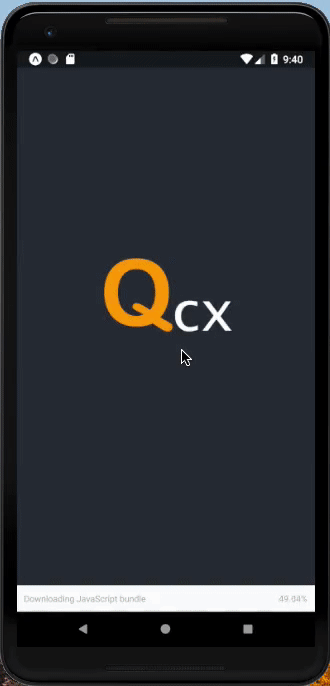
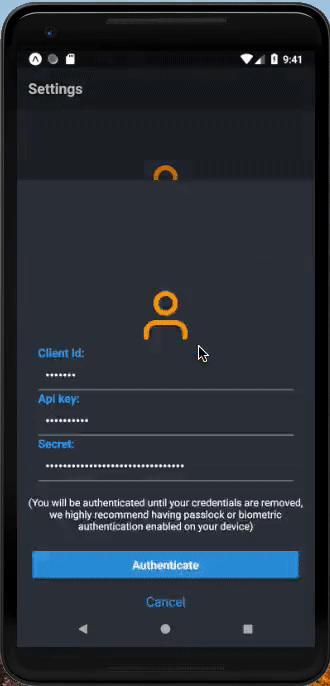
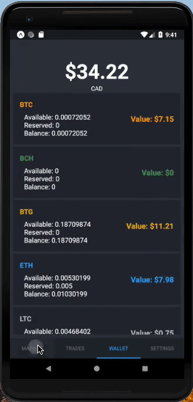

# Qcx

Welcome to Qcx, a mobile client for trading on the Quadriga platform. 

# Features: 
- Within App Trading
- Access account value and individual coin value
- Simple examination of tranding history
- View and maintain open orders

Try out the app here:
Supports Both iOS & Android
# Link: [https://exp.host/@kh42/qcx]

# Here's what it looks like: 

	
  
  

# Try the Code
If you want to install the code, you will need the following: 

- [ ] alphaAdvantageKey (create an account and grab the api key)
- [ ] a Sentry link and change the sentry details in the app.json file
- [ ] create a file under src/components/common named 'keys.js' where you will store the above keys (or directly in the files using the keys if you wish)
- [ ] install expo

# Todo
- [ ] Secure Storage
- [ ] Quadriga API Call Refactor
- [ ] Pro Features: 
  - [ ] Local Authentication: Finger Print, Face ID
  - [ ] Alert notifications
  - [ ] Filtering past txns
  - [ ] Withdrawl and Deposits
- [ ] Past txn display beyond BTC_CAD pairing

# Contribute
If you wish to contribute to this project, feel free to contact me. 

# Donate

### BTC: 37ps2nTmRLYTUpNyZh9c7xLrg179QoBbGz

### BCH: 1BU3rydSUP2U89CJnKjSGrvxQEDakae5wV

### ETH: 0x878d23ebe1d2137586b56ad8a76ac7c9415710cf

### LTC: MFjF6iSBiRY3caj8wKC6mmKp5R4CyVijp9

### XMR: 87AVDUbLEktXV1SM1KZ1baaA33HzemR3QGoFXKUvpQjX1Mjjs46JVnJi4dgjV4VPRj9bbEvCvnfdCaAB5EzgXd9JMJ4U2bg

### ZCASH: t1YjqSpuopLB6z4ptSRKbfMMYsQdYzc5zJN

### NANO: xrb_18kd17tsubwqocimafpjbgiggnpdff8836b8gb55trtedrxopctww76wmorw

